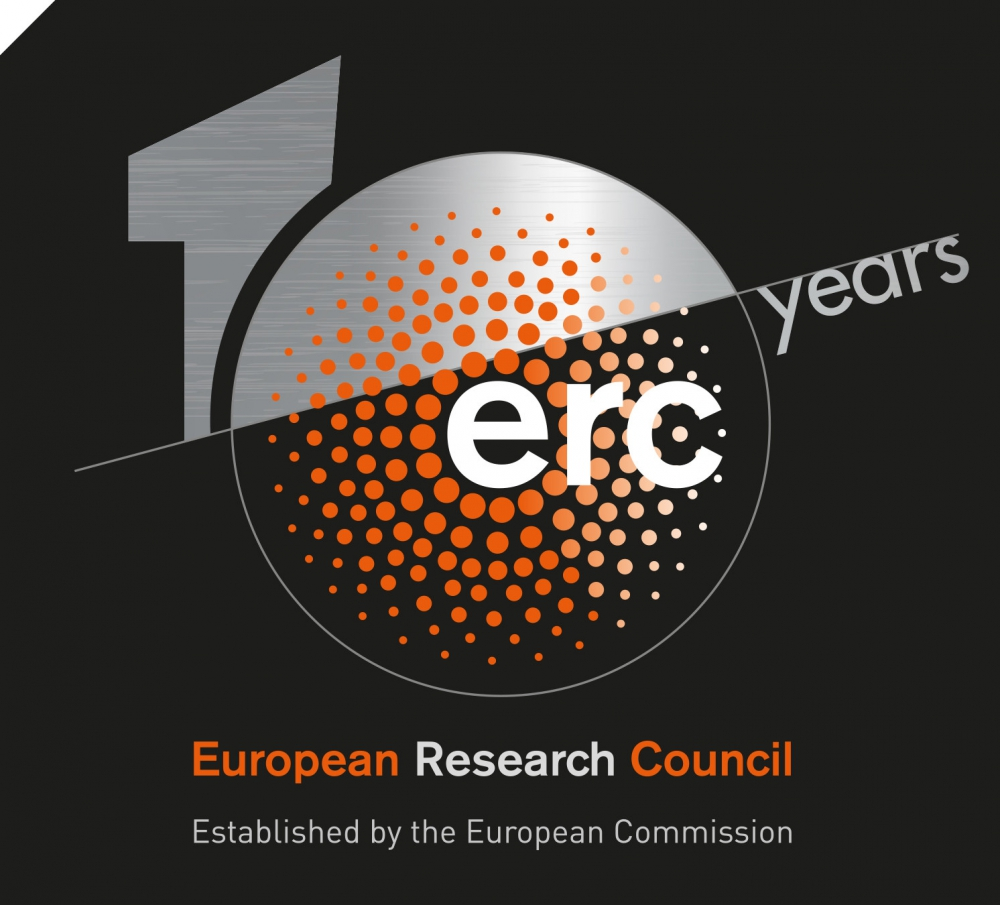

Students can be funded to join the lab via studentships from their home countries or the the Wellcome Trust 4 year PhD program in Developmental Mechanisms:

[http://www.pdn.cam.ac.uk/phd/](http://www.pdn.cam.ac.uk/phd/)

Or the Cambridge Trust:

[http://www.cambridgetrust.org/](http://www.cambridgetrust.org/)

Or the UK BBSRC DTP Programme:

[http://bbsrcdtp.lifesci.cam.ac.uk/](http://bbsrcdtp.lifesci.cam.ac.uk/)

Funding
-------

We are currently funded by the Wellcome Trust and European Research Council.

{:style="height: 100px;"}
{:style="height: 100px;"}