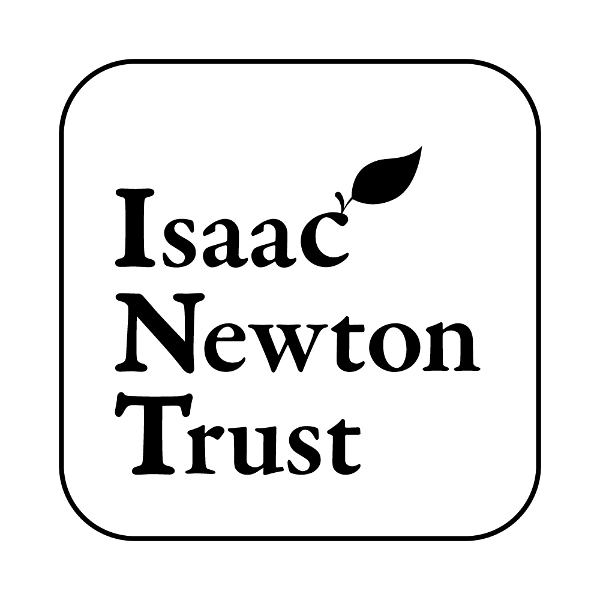

If you are interested in joining us please send your CV and a covering email describing your interests and motivations to [Jenny](mailto:jlg38@cam.ac.uk). We are happy to work with postdoc applicants to apply for fellowships and we can sometimes offer short term salary support. PhD students usually join the lab via studentships from external funders and Masters students applying for an MPhil typically self-fund. 

The lab has trained 9 postdocs, 2 PhD students, 2 research assistants and many Part II and Part III Biochemistry students. Previous postdocs and PhD students have moved to further research positions in academia, project management in industry, data science and government/policy.

Funding
-------

Since 2011, Jenny's work has been funded by the Wellcome Trust.

{:style="height: 100px;"}

We have also previously been supported by a European Research Council Starting Grant and Equipment and Bridging grants from the Issac Newton Trust.

{:style="height: 100px;"}

{:style="height: 100px;"}
